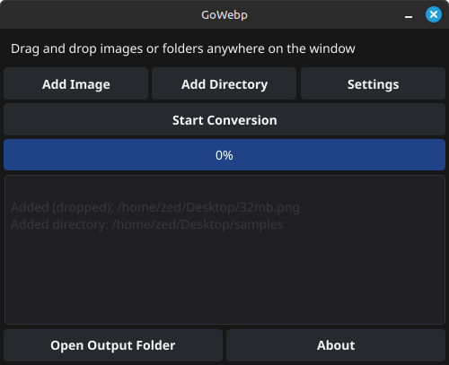

# GoWebp

A cross-platform batch image-to-WebP converter with a modern GUI, written in Go.

## Features

- **Drag-and-drop** or browse to select images/folders
- **Batch conversion** to WebP with preserved folder structure
- Adjustable **quality** and **concurrency**
- **Progress bar** and detailed **log pane**
- **Cross-platform**: Works on Linux, Windows, and macOS
- Lightweight and fast, with a modern GUI built using [Fyne](https://fyne.io/)

## Screenshot



## Installation

### Prerequisites

Before building or running GoWebp, ensure you have the following installed:

- **Go 1.21+**: [Download here](https://golang.org/dl/)
- **Fyne dependencies**:
  - On **Linux**: Install OpenGL and X11 development libraries:
    ```bash
    sudo apt-get install -y libgl1-mesa-dev xorg-dev
    ```
  - On **macOS**: Install `pkg-config` using Homebrew:
    ```bash
    brew install pkg-config
    ```
  - On **Windows**: No additional dependencies are required.

### Build Instructions

Follow these steps to build the project for your platform:

1. Clone the repository:
   ```bash
   git clone https://github.com/nickravesh/GoWebp.git
   cd GoWebp
   ```

2. Install dependencies:
   ```bash
   go mod tidy
   ```

3. Build the executable:

   - **For Windows**:
     ```bash
     GOOS=windows GOARCH=amd64 go build -o GoWebp-windows.exe ./cmd/GoWebp
     ```

   - **For Linux**:
     ```bash
     GOOS=linux GOARCH=amd64 go build -o GoWebp-linux ./cmd/GoWebp
     ```

   - **For macOS**:
     ```bash
     GOOS=darwin GOARCH=amd64 go build -o GoWebp-macos ./cmd/GoWebp
     ```

## Usage

1. Launch the application.
2. Drag and drop images or folders into the window, or use the **Add Image** or **Add Directory** buttons to select files.
3. Adjust settings (quality, concurrency) using the **Settings** button.
4. Click **Start Conversion** to begin converting images to WebP format.
5. View progress in the progress bar and logs in the log pane.
6. Open the output folder using the **Open Output Folder** button.

## Troubleshooting

### OpenGL Errors on Windows
If you encounter an error like:
```
Fyne error: window creation error
Cause: APIUnavailable: WGL: The driver does not appear to support OpenGL
```
This means your system does not support OpenGL. To resolve this:
- Update your graphics drivers.
- If running in a VM, enable 3D acceleration.
- Use a machine with OpenGL 2.1+ support.

### Missing Dependencies on Linux
Ensure you have installed the required OpenGL and X11 libraries:
```bash
sudo apt-get install -y libgl1-mesa-dev xorg-dev
```

## Contributing

Contributions are welcome! Feel free to open issues or submit pull requests on [GitHub](https://github.com/nickravesh/GoWebp).

## License

This project is licensed under the GNU GPL v3. See the [LICENSE](LICENSE) file for details.